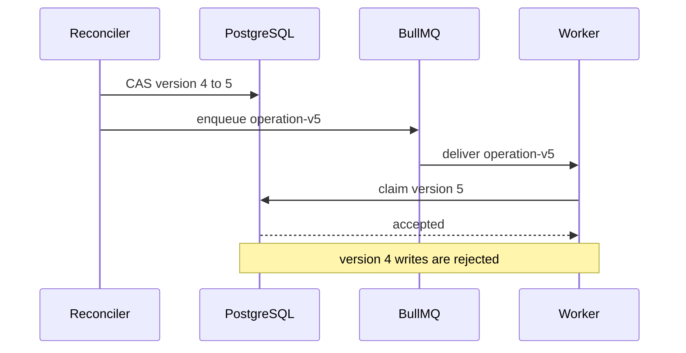
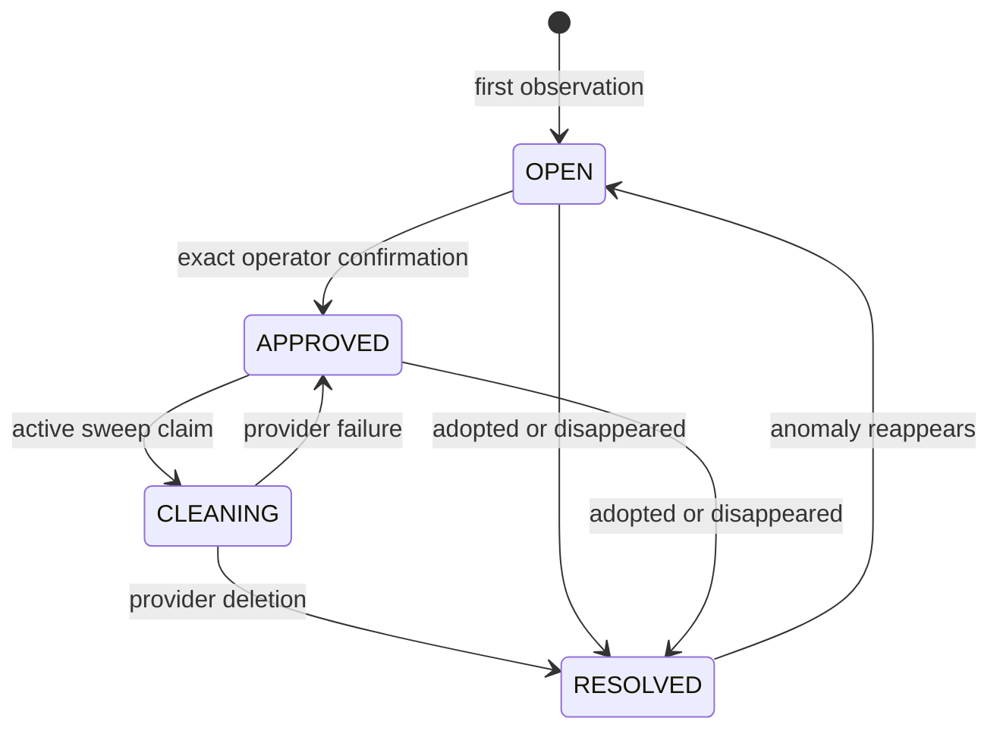

# Phase 3: database reconciliation and orphan safety

This checkpoint completes the next durability slice after David provisioning.
It does not introduce another public service. A scheduled BullMQ job runs in the
existing private orchestrator worker and reconciles PostgreSQL control-plane
state against the provider inventory.

## Execution fencing and stale recovery

Every `DatabaseInstance` owns a monotonically increasing `operationVersion`.
The version is included in every database-operation job and in every worker
compare-and-swap mutation.

When a heartbeat is older than `DATABASE_STALE_AFTER_MS`, the reconciler:

1. increments `operationVersion` and `recoveryCount` atomically;
2. updates the heartbeat before dispatch;
3. enqueues a new job whose BullMQ ID contains the new version;
4. causes any earlier worker to lose its next heartbeat or state-transition CAS;
5. relies on provider idempotency to reconcile a resource created immediately
   before an old worker was fenced.

Legacy Phase 3 jobs without a version parse as version zero, preserving a
rolling upgrade from the preceding checkpoint.



Retryable `FAILED` operations are recovered up to
`DATABASE_MAX_RECOVERY_ATTEMPTS`. Exhaustion persists a
`RECOVERY_EXHAUSTED` finding, changes the operation to a non-retryable failure,
and emits a customer-visible status event without credentials.

## Provider inventory reconciliation

`DatabaseProvider.listManagedResources()` exposes a normalized provider-neutral
inventory. The Supabase adapter returns only resources whose
`organization_slug` exactly matches the configured organization and whose names
match the strict platform-generated naming pattern. Customer-created projects
and projects from another accessible organization are excluded.

| Inventory comparison | Durable result | Automatic destructive action |
| --- | --- | --- |
| Tracked locally and present remotely | Prior missing finding is resolved | None |
| Tracked locally but absent remotely | `PROVIDER_RESOURCE_MISSING` finding | None |
| Present remotely but untracked locally | `ORPHAN_PROVIDER_RESOURCE` finding | None by default |
| Previously orphaned but now tracked | Finding resolved as `ADOPTED` | None |
| Previously orphaned and no longer remote | Finding resolved as `NO_LONGER_PRESENT` | None |

A READY/SUSPENDED database is marked failed only after it is absent from two
successful provider inventories. A transient provider API failure fails the
entire sweep before recovery or missing-resource decisions are applied.

## Approval-gated orphan cleanup

Orphan deletion is fail-closed and requires all of the following:

- a strict platform-managed provider name;
- two or more independent inventory observations;
- expiration of `DATABASE_ORPHAN_GRACE_MS` from first observation;
- an `APPROVED` durable finding containing the exact provider external ID;
- the literal confirmation `APPROVE_ORPHAN_DATABASE_DELETION` through the
  private operator command;
- `DATABASE_APPROVED_ORPHAN_CLEANUP_ENABLED=true` in the worker environment.

Immediately before deletion, the repository atomically verifies that the sweep
lease is still RUNNING, the exact finding is still approved and past grace, and
no non-deleted `DatabaseInstance` has adopted the external ID. It then changes
the finding to `CLEANING`, preventing two sweeps from issuing the same action.
Failed calls release the claim; crash-abandoned claims return to `APPROVED` when
the next sweep acquires the provider lease.

Approval example:

```bash
DATABASE_URL=<control-plane-postgres-url> \
pnpm --filter @atoms/orchestrator-worker approve:orphan-cleanup -- \
  --finding-id <uuid> \
  --external-id <provider-project-ref> \
  --approved-by <operator-id> \
  --confirmation APPROVE_ORPHAN_DATABASE_DELETION
```

The command only records approval. It does not contact Supabase or delete a
resource. The next successful scheduled sweep revalidates inventory, grace,
observation count, exact external ID, approval, and the worker cleanup switch
before calling `destroy`.

## Sweep lease and audit model

`DatabaseReconciliationSweep` is the immutable execution summary. A partial
unique PostgreSQL index permits only one RUNNING sweep per provider. An
abandoned sweep is failed after `DATABASE_ABANDONED_SWEEP_AFTER_MS`, allowing a
new scheduler delivery to proceed.

`DatabaseReconciliationFinding` stores only provider resource metadata and
control-plane identifiers. It records first/last observation, observation
count, cleanup boundary, approval identity/time, and resolution. It never
stores access tokens, database passwords, connection URLs, or Vault values.



## Operational defaults

| Variable | Default | Boundary |
| --- | ---: | --- |
| `DATABASE_RECONCILIATION_INTERVAL_MS` | 300000 | BullMQ scheduler interval |
| `DATABASE_STALE_AFTER_MS` | 1200000 | stale operation fence threshold |
| `DATABASE_ORPHAN_GRACE_MS` | 86400000 | minimum orphan quarantine |
| `DATABASE_ABANDONED_SWEEP_AFTER_MS` | 1800000 | sweep execution lease |
| `DATABASE_MAX_RECOVERY_ATTEMPTS` | 3 | automatic recovery ceiling |
| `DATABASE_RECOVERY_BATCH_SIZE` | 100 | per-sweep recovery cap |
| `DATABASE_APPROVED_ORPHAN_CLEANUP_ENABLED` | false | report-only unless enabled |

No live or billable provider action is enabled in normal test or worker startup
by this checkpoint. The separate manual staging workflow requires exact inputs,
a protected-environment review, count-only isolation controls, and a dedicated
audit database before its one owned Supabase resource can be created. Supabase,
Vault, E2B, PostgreSQL, and Redis credentials remain deployment-time gates.
