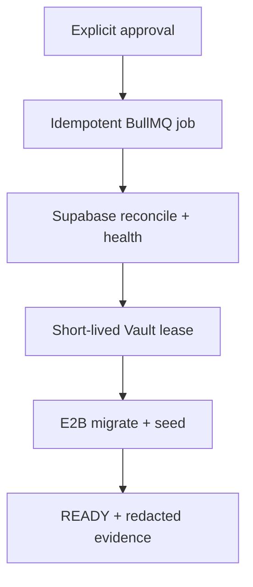
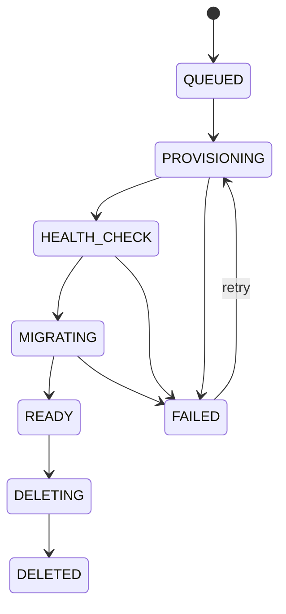
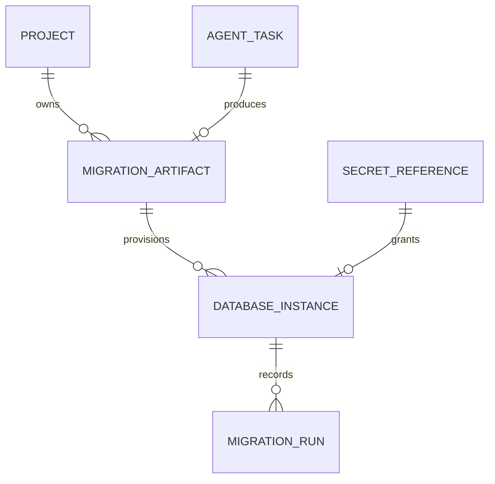

# Phase 3: David and generated PostgreSQL provisioning

## Implemented vertical slice

David is the fifth active LangGraph agent. After Alex commits its compare-and-swap
patch, David reads the same immutable project revision and returns a schema-bound
artifact containing:

- forward-only Prisma migration files;
- an idempotent seed file;
- migration risk classification and explicit destructive-change disclosures;
- a data-policy report without credentials or provider state.

The worker commits David's files atomically, hashes the referenced
`schema.prisma` with SHA-256, and stores a validated `MigrationArtifact`. A newer
artifact supersedes the previous artifact; it does not mutate it.

## Provisioning lifecycle

1. The client calls `POST /v1/projects/{projectId}/databases` with an
   `Idempotency-Key`, a validated `migrationArtifactId`, and the literal
   `PROVISION_DATABASE` confirmation.
2. If David classified any migration as destructive,
   `approveDestructiveChanges: true` is also mandatory. Missing approval returns
   `409 DESTRUCTIVE_MIGRATION_APPROVAL_REQUIRED` before any queue or provider
   call.
3. PostgreSQL creates one `DatabaseInstance(QUEUED)` per idempotency key and
   BullMQ receives a deterministic job ID. A retry returns the same instance.
4. The non-public orchestrator worker claims the operation and calls the
   provider-neutral `DatabaseProvider`.
5. `SupabaseDatabaseProvider` reconciles a deterministic external project name
   before creating a resource. The database password is generated and persisted
   in Vault before the Management API call, closing the crash window between
   creation and retry.
6. The adapter polls `/v1/projects/{ref}/health` until every required service is
   healthy. Timeouts and provider throttling are retryable BullMQ failures.
7. A 15-minute `migrate` secret lease is copied from the persistent Vault
   reference. Only the opaque reference and expiry are persisted.
8. A disposable E2B VM receives the project snapshot and `DATABASE_URL` as a
   process environment value. Its egress is limited to package/Prisma hosts and
   the exact generated database hostname.
9. The VM executes fixed commands: frozen install, `prisma migrate deploy`,
   `prisma db seed`, and `prisma migrate status`. Reports are redacted before
   persistence.
10. The lease is revoked in `finally`; success marks `MigrationRun(SUCCEEDED)`
    and `DatabaseInstance(READY)`.





## Platform data-model update



`IntegrationConnection` records Supabase account/organization metadata and only
an opaque credential reference. `SecretReference` stores provider, purpose,
status, and expiry; it has no secret-value column.

## Destructive-change approval card contract

The UI must show the target project, provider, region, migration artifact hash,
each destructive migration description, and the irreversible effect. The
confirm button sends `approveDestructiveChanges: true` plus the literal
`PROVISION_DATABASE`. Closing the card or changing the artifact must not retain
the approval.

## Teardown

`POST /v1/projects/{projectId}/databases/{databaseId}/actions` accepts only
`{"action":"destroy","confirmation":"DESTROY_DATABASE"}`. The worker deletes
the Supabase project, revokes the stored connection capability, and persists
`DELETED`. A missing confirmation is rejected before enqueueing.

## Internal provider contract

```ts
interface DatabaseProvider {
  readonly name: "SUPABASE";
  provision(input: {
    operationId: string;
    projectId: string;
    displayName: string;
    region: string;
  }): Promise<{
    externalId: string;
    databaseName: string;
    region: string;
    connectionSecretRef: string;
    providerOperationMetadata: Record<string, string>;
  }>;
  listManagedResources(): Promise<readonly {
    externalId: string;
    name: string;
    region: string | null;
    status: string | null;
    createdAt: string | null;
  }[]>;
  getHealth(externalId: string): Promise<DatabaseHealthStatus>;
  getEphemeralConnection(
    externalId: string,
    scope: "migrate" | "runtime",
    connectionSecretRef: string,
  ): Promise<{ reference: string; expiresAt: string }>;
  destroy(externalId: string, connectionSecretRef?: string): Promise<void>;
}
```

Neon is intentionally not implemented in this slice; the interface and worker
do not depend on Supabase response types, so it remains a future adapter.

## Security invariants

| Asset | Allowed location | Forbidden boundary |
| --- | --- | --- |
| Supabase access token | private worker environment / managed secret injection | browser, agent prompt, PostgreSQL, SSE |
| Database password and URL | Vault; short-lived E2B environment | logs, command arguments, events, API responses |
| Secret reference | PostgreSQL lifecycle metadata | generated browser code |
| Migration diagnostics | PostgreSQL after URL/password redaction | raw provider response dumps |

Provider-live validation remains credential- and billing-gated. Without explicit
live-test opt-in, verification covers the real HTTP adapter, crash reconciliation,
Vault KV v2 calls, durable state machine, egress policy, redaction, and E2B command
contract with deterministic test doubles.

Scheduled inventory reconciliation, operation-version fencing, and the
approval-gated orphan workflow are specified in
`docs/phase-3-database-reconciliation.md`.
